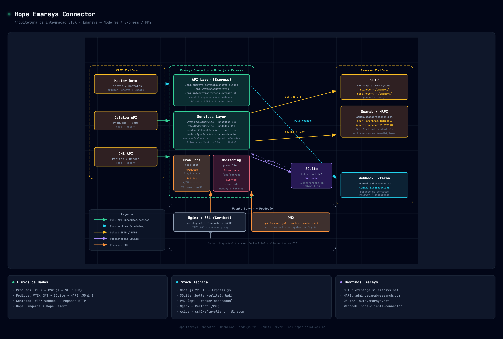

# Hope Emarsys Connector

Sistema de integração entre VTEX e Emarsys para sincronização de produtos, pedidos e contatos.



## Visão Geral

O **Hope Emarsys Connector** é uma aplicação Node.js/Express que atua como ponte entre a plataforma de e-commerce VTEX e a plataforma de marketing Emarsys.

### Tecnologias

| Categoria | Tecnologia | Uso |
|---|---|---|
| Runtime | Node.js 22 (LTS) | Servidor |
| Framework | Express.js | API REST |
| Banco de Dados | SQLite (better-sqlite3, WAL) | Persistência de contatos |
| HTTP Client | Axios | VTEX API, webhooks, Emarsys API |
| SFTP | ssh2-sftp-client | Upload de catálogo de produtos |
| Auth | OAuth2 (client_credentials) | Autenticação Emarsys |
| Segurança | Helmet, CORS, dotenv | Headers HTTP, variáveis de ambiente |
| Logging | Winston | Logs estruturados por módulo |
| Métricas | prom-client + Grafana | Monitoramento Prometheus |
| Agendamento | node-cron | Cron jobs (produtos, pedidos, retry) |
| Produção | PM2, Docker | Gerenciamento de processos |

### Fluxos de Dados

```
PRODUTOS (Hope):   VTEX hopelingerie → products.csv (ativos + inativos) → SFTP bu_hope        (diário 02h)
PRODUTOS (Resort): VTEX lojahr       → products_resort.csv              → SFTP hope_resort    (diário 03h)
PEDIDOS (Hope):    VTEX hopelingerie → CSV binary → Emarsys merchant 1789FBAF0A6EF683 bearer token  (a cada 10min)
PEDIDOS (Resort):  VTEX lojahr       → CSV binary → Emarsys merchant 15232C841F7635A9 bearer token  (a cada 10min)
CONTATOS:          VTEX → POST webhook entrada → SQLite → Webhook saída (tempo real + retry por client_type)
```

### Processos em produção

```
pm2 → api    (server.js)   — Express HTTP, rotas, webhooks, monitoramento
pm2 → worker (worker.js)   — Cron jobs exclusivamente: produtos, pedidos, retry de contatos
```

Os dois processos são independentes. Se o worker travar num sync longo, a API continua respondendo normalmente. Se a API reiniciar, os crons continuam no worker sem interrupção.

| Processo | Reiniciar sem afetar | Crons ativos |
|---|---|---|
| `api` | worker continua | nenhum |
| `worker` | api continua | produtos, pedidos, retry contatos |

**Cron jobs no worker:**

| Job | Schedule | Ação |
|---|---|---|
| `products-sync` | `PRODUCTS_SYNC_CRON` (padrão `0 */8 * * *`) | Direto: `fetchAllProductRows` → CSV → SFTP (sem passar pela API) |
| `orders-sync` | `ORDERS_SYNC_CRON` (padrão `*/30 * * * *`) | POST `/api/background/cron-orders` → Hope + Resort |
| `contacts-retry` | `CONTACTS_RETRY_CRON` (padrão `*/5 * * * *`) | Direto: `contactRetryService.processFailedContacts()` |

> O cron de pedidos dispara via HTTP para a própria API (retorna jobId imediatamente, execução em background). Produtos e retry de contatos chamam os serviços diretamente, sem depender da API estar no ar.

## Arquitetura

```
Emarsys-Connector/
├── server.js                   # Servidor Express — rotas, middlewares, webhooks (sem crons)
├── worker.js                   # Processo worker — cron jobs exclusivamente (sem HTTP)
├── scripts/
│   ├── syncProducts.js        # Sync diário Hope (02h) + Resort (03h)
│   └── syncOrders.js          # Sync 10min Hope + Resort (crons independentes)
├── services/
│   ├── vtexProductService.js      # fetchAllProductRows + fetchAllProductRowsResort
│   ├── vtexOrderService.js        # fetchNewOrderRows + fetchNewOrderRowsResort
│   ├── emarsysOrdersApiService.js # Envio CSV binary via OAuth2 para Scarab/HAPI
│   ├── emarsysOAuth2Service.js    # Token OAuth2 com cache e renovação automática
│   ├── contactWebhookService.js   # Webhook de contatos + persistência SQLite
│   ├── contactRetryService.js     # Retry de contatos com backoff exponencial
│   └── ...                        # outros serviços legados
├── helpers/
│   ├── csvHelper.js           # generateCsv(rows, fileName) — products.csv e products_resort.csv
│   └── sftpHelper.js          # uploadToSftp (Hope) + uploadToSftpResort
├── routes/                    # Endpoints REST (produtos, pedidos, contatos, métricas)
├── database/                  # SQLite WAL (contatos)
├── utils/                     # Logger, cron service, métricas, auth
├── data/                      # lastOrderSync.json + lastOrderSyncResort.json, SQLite DB
├── tmp/                       # CSVs gerados localmente
└── logs/                      # Logs rotativos diários
```

---

## Fluxo de Produtos

### Processo completo

Roda via `scripts/syncProducts.js` ou manualmente com `npm run sync:products`.

Ambas as lojas usam a **mesma lógica interna** — apenas com credenciais e destinos diferentes:

| | Hope Lingerie | Hope Resort |
|---|---|---|
| **VTEX** | `hopelingerie.vtexcommercestable.com.br` | `lojahr.vtexcommercestable.com.br` |
| **Arquivo** | `products.csv` | `products_resort.csv` |
| **SFTP user** | `bu_hope` | `hope_resort` |
| **SFTP path** | `/` | `/` |
| **Cron** | diário 02h | diário 03h |

```
PASSO 1 — GetProductAndSkuIds
  Coleta todos os skuIds (ativos + inativos + invisíveis)
  ~188 chamadas paginadas de 50 em 50
  Resultado: ~27.287 skuIds únicos

PASSO 2 — products/search (lotes de 50)
  Busca detalhes dos SKUs visíveis na loja
  Retorna: price, msrp, c_stock, title, link, image, category, available
  ~546 chamadas → ~3.378 SKUs ativos

PASSO 3 — stockkeepingunitbyid (lotes de 25 paralelos)
  SKUs inativos/invisíveis que não retornaram no PASSO 2
  price/msrp/c_stock ficam vazios (produto inativo)
  ~970 lotes → ~24.225 SKUs inativos

PASSO 4 — Deduplicar + gerar CSV
  Ativos têm prioridade em duplicatas
  BOM UTF-8 obrigatório, separador vírgula

PASSO 5 — Upload SFTP
  fastPut com keepalive para arquivos grandes (~16MB)
```

> **Por que incluir inativos:** pedidos históricos de 2 anos cruzam com o catálogo — se o produto não existir no Emarsys, o histórico de compras do cliente fica incompleto e recomendações quebram.

### Colunas do products.csv

Ordem exata obrigatória — não alterar:

| Coluna | Ativos | Inativos |
|---|---|---|
| `item` | itemId numérico | itemId numérico |
| `title` | productName | ProductName |
| `link` | URL completa VTEX | STORE_BASE_URL + DetailUrl |
| `image` | imageUrl | ImageUrl |
| `category` | Ex: `Calcinhas > Biquíni` | Ex: `Calcinhas > Biquíni` |
| `available` | `"true"` ou `"false"` | `"false"` (IsActive) |
| `description` | Texto limpo sem \n | Texto limpo sem \n |
| `price` | Preço de venda | vazio |
| `msrp` | Preço de lista | vazio |
| `group_id` | productId | ProductId |
| `c_stock` | AvailableQuantity | `0` |
| `c_sku_id` | itemId | Id |
| `c_product_id` | productId | ProductId |

### Performance

| Etapa | Chamadas | Tempo |
|---|---|---|
| GetProductAndSkuIds | ~188 | ~1-2 min |
| products/search | ~546 | ~3-5 min |
| stockkeepingunitbyid | ~970 lotes de 25 | ~12-15 min |
| CSV + SFTP | — | ~1 min |
| **Total** | **~1.704** | **~17-23 min** |

### SFTP de Produtos

```env
# Hope
SFTP_PRODUCTS_HOST=exchange.si.emarsys.net
SFTP_PRODUCTS_PORT=22
SFTP_PRODUCTS_USERNAME=bu_hope
SFTP_PRODUCTS_PASSWORD=***
SFTP_PRODUCTS_REMOTE_PATH=/
STORE_BASE_URL=https://www.hopelingerie.com.br

# Hope Resort
RESORT_SFTP_HOST=exchange.si.emarsys.net
RESORT_SFTP_PORT=22
RESORT_SFTP_USER=hope_resort
RESORT_SFTP_PASSWORD=***
RESORT_SFTP_REMOTE_DIR=/
RESORT_STORE_BASE_URL=https://www.lojahr.com.br
```

---

## Fluxo de Pedidos

### Processo completo

Roda a cada 10 minutos via `scripts/syncOrders.js` ou manualmente com `npm run sync:orders`.

As duas lojas rodam em **crons independentes** com controle de concorrência separado (`isRunning` / `isRunningResort`) e arquivos de controle distintos:

| | Hope Lingerie | Hope Resort |
|---|---|---|
| **VTEX** | `hopelingerie.vtexcommercestable.com.br` | `lojahr.vtexcommercestable.com.br` |
| **Emarsys merchant** | `1789FBAF0A6EF683` | `15232C841F7635A9` |
| **Controle de estado** | `data/lastOrderSync.json` | `data/lastOrderSyncResort.json` |
| **Cron** | a cada 10min | a cada 10min |

```
A cada 10 minutos (por loja):

PASSO 1 — Ler lastOrderSync[Resort].json
  Se não existe: busca últimos 10 minutos (primeira execução)
  now capturado ANTES de qualquer chamada de API

PASSO 2 — GET /api/oms/pvt/orders
  Filtra por f_creationDate=[lastSync TO now]
  Pagina até esgotar (100 por página)

PASSO 3 — GET /api/oms/pvt/orders/{orderId}
  1 por vez, 300ms entre chamadas
  Retry 3x em erro, aguarda 5s em 429

PASSO 4 — Mapear para linhas CSV
  CPF → SHA256 (nunca usar email — vem mascarado pela VTEX)
  1 linha por item do pedido

PASSO 5 — Enviar CSV binary para Scarab/HAPI
  POST via EmarsysOrdersApiService (OAuth2 por loja)
  Em caso de erro: lastSync NÃO atualizado → reprocessa na próxima execução
```

> **Atenção:** o Emarsys trata `order` como chave única — reenviar o mesmo pedido gera duplicata. O sync não usa overlap nem margem de tempo para evitar isso.

### Colunas do CSV de Pedidos

Ordem exata obrigatória — não alterar:

| Campo | Descrição | Origem VTEX |
|---|---|---|
| `item` | SKU (mesmo do products.csv) | `items[n].id` |
| `price` | Preço unitário (`149.90`) | `items[n].price ÷ 100` |
| `order` | ID do pedido | `orderId` |
| `timestamp` | Data/hora ISO 8601 UTC (`2024-04-01T13:22:00Z`) | `creationDate` |
| `customer` | CPF hasheado SHA-256 (64 hex chars) | `clientProfileData.document` |
| `quantity` | Quantidade | `items[n].quantity` |
| `s_sales_channel` | Canal de vendas | `salesChannel` |
| `s_store_id` | Hostname da loja | `hostname` |
| `s_canal` | Origem do pedido | `origin` |
| `s_loja` | Hostname da loja | `hostname` |
| `s_tipo_pagamento` | Forma de pagamento | `paymentData.transactions[0].payments[0].paymentSystemName` |
| `s_cupom` | Código do cupom (somente o código, ex: `PROMO10`) | `marketingData.coupon` |
| `f_valor_desconto` | Valor absoluto do desconto em decimal (`75.00`) — vazio se sem desconto. Prefixo `f_` = float no Emarsys | `abs(totals[Discounts].value) ÷ 100` |

### Autenticação

A API Scarab HAPI usa **token estático bearer** (prioridade). OAuth2 é mantido como fallback.

```env
# Hope
EMARSYS_SALES_TOKEN=<bearer_token_hope>
EMARSYS_ORDERS_API_URL=https://admin.scarabresearch.com/hapi/merchant/1789FBAF0A6EF683/sales-data/api
EMARSYS_ORDERS_API_TIMEOUT=60000

# Hope Resort
EMARSYS_SALES_TOKEN_RESORT=<bearer_token_resort>
EMARSYS_ORDERS_API_URL_RESORT=https://admin.scarabresearch.com/hapi/merchant/15232C841F7635A9/sales-data/api
EMARSYS_ORDERS_API_TIMEOUT_RESORT=60000

# OAuth2 (fallback — usado se EMARSYS_SALES_TOKEN não estiver configurado)
EMARSYS_OAUTH2_CLIENT_ID=
EMARSYS_OAUTH2_CLIENT_SECRET=
EMARSYS_OAUTH2_TOKEN_ENDPOINT=https://auth.emarsys.net/oauth2/token
```

### Performance

```
A cada 10 minutos em produção:
  ~5-20 pedidos × 300ms = ~2-6s total ✅

Pico (campanha):
  ~200 pedidos × 300ms = ~60s — dentro dos 10min ✅
```

---

## Fluxo de Contatos

### Arquitetura de Webhooks (entrada + saída)

```
VTEX Master Data (cliente criado/atualizado)
  │
  └─ POST https://api.hopeoficial.com.br/api/emarsys/contacts/webhook    ← Webhook de ENTRADA
       │
       ├─ Valida email obrigatório
       ├─ Idempotência (ignora duplicatas em janela de 15s)
       ├─ Persiste no SQLite (status: pending, client_type: hope|resort)
       │
       └─ POST <CONTACTS_WEBHOOK_URL>/sync         ← Webhook de SAÍDA
            │
            ├─ Sucesso → status: sent
            └─ Falha → status: failed
                 │
                 └─ Cron (5min) reprocessa por fila separada
                      ├─ Fila "hope"   → CONTACTS_WEBHOOK_URL_HOPE
                      ├─ Fila "resort" → CONTACTS_WEBHOOK_URL_RESORT
                      ├─ Backoff exponencial: attempts × 2 min
                      ├─ Máx 5 tentativas
                      └─ Excedeu → dead (alerta crítico)
```

### Payload do Webhook

```json
{
  "customer_id": "a3f8c2e1d94b76f0e5a1c3d2b8f4e9a7c6d1b2e3f5a0c4d7e8b9f2a1c3e6d4",
  "client_type": "hope",
  "email": "cliente@email.com",
  "cpf": "38439322113",
  "first_name": "Gabriel",
  "last_name": "Lima",
  "phone": "+551133334444",
  "mobile": "+5511999998888",
  "gender": "M",
  "address": "Avenida Paulista, 1000",
  "city": "São Paulo",
  "state": "SP",
  "country": 24,
  "postal_code": "01310-100",
  "opt_in": true
}
```

> Campos opcionais enviam `null` quando não preenchidos. `country` deve sempre ser `24` (código Emarsys para Brasil) — o conector atende exclusivamente clientes brasileiros.

### Configuração

```env
CONTACTS_WEBHOOK_URL=https://exemplo.ngrok-free.dev/sync
CONTACTS_WEBHOOK_URL_HOPE=https://hope-webhook.exemplo.com/sync
CONTACTS_WEBHOOK_URL_RESORT=https://resort-webhook.exemplo.com/sync
CONTACTS_WEBHOOK_CLIENT_TYPE=hope
CONTACTS_WEBHOOK_AUTH_HEADER=
CONTACTS_WEBHOOK_TIMEOUT=30000
```

---

## Instalação

### Pré-requisitos

- Node.js >= 22.x (LTS)
- NPM
- PM2 (produção)

### Setup

```bash
git clone https://dev.azure.com/gabrielaraujo-openflow/Hope/_git/Emarsys-Connector
cd Emarsys-Connector
npm install
cp .env.example .env
# Editar .env com as credenciais
```

### Desenvolvimento

```bash
npm run dev
```

### Produção

```bash
npm run prod           # inicia api + worker via PM2
pm2 list               # api e worker ambos online
npm run prod:logs      # logs da API
npm run prod:logs:worker  # logs do worker (crons)
```

---

## Scripts

| Script | Descrição |
|---|---|
| `npm run worker` | Inicia o worker de cron jobs (produção manual) |
| `npm run worker:dev` | Inicia o worker com nodemon (desenvolvimento) |
| `npm run sync:products` | Sync manual de produtos (VTEX → CSV → SFTP) |
| `npm run sync:orders` | Sync manual de pedidos (executa imediatamente + cron 10min) |
| `npm run clear-logs` | Limpa arquivos de log |
| `npm run cleanup:exports` | Remove exports antigos |
| `npm run logs` | Tail do log combinado do dia |

---

## APIs Principais

### Produtos

| Método | Endpoint | Descrição |
|---|---|---|
| POST/GET | `/api/vtex/products/sync` | Sincroniza produtos (background) |
| GET | `/api/vtex/products/test-sftp` | Testa conectividade SFTP |
| GET | `/api/vtex/products/stats` | Estatísticas dos produtos |

### Pedidos

| Método | Endpoint | Descrição |
|---|---|---|
| GET | `/api/integration/orders-extract-all` | Extrai e processa pedidos |
| GET | `/api/emarsys/sales/sync-status` | Status da sincronização |
| POST | `/api/emarsys/sales/send-unsynced` | Envia pedidos pendentes |

### Contatos

| Método | Endpoint | Descrição |
|---|---|---|
| POST | `/api/emarsys/contacts/webhook` | Webhook de entrada (VTEX → nós → saída) |
| POST | `/api/emarsys/contacts/create-single` | Cria contato manual |
| POST | `/api/emarsys/contacts/extract-recent` | Extrai contatos recentes da VTEX |

### Monitoramento

| Método | Endpoint | Descrição |
|---|---|---|
| GET | `/health` | Health check |
| GET | `/api/metrics/dashboard` | Dashboard de métricas |
| GET | `/api/metrics/prometheus` | Métricas Prometheus |
| GET | `/api/metrics/contacts/retry-status` | Status do retry de contatos |
| GET | `/api/alerts/active` | Alertas ativos |
| GET | `/api/cron-management/status` | Status dos cron jobs |

---

## Configuração

### Variáveis de Ambiente Principais

```env
# Server
PORT=3000
NODE_ENV=development
BASE_URL=https://api.hopeoficial.com.br

# VTEX - Hope Lingerie
VTEX_BASE_URL_HOPE=https://hopelingerie.vtexcommercestable.com.br
VTEX_APP_KEY_HOPE=
VTEX_APP_TOKEN_HOPE=
STORE_BASE_URL=https://www.hopelingerie.com.br

# VTEX - Hope Resort
RESORT_VTEX_BASE_URL=https://lojahr.vtexcommercestable.com.br
RESORT_VTEX_APP_KEY=
RESORT_VTEX_APP_TOKEN=
RESORT_STORE_BASE_URL=https://www.lojahr.com.br

# SFTP Produtos - Hope
SFTP_PRODUCTS_HOST=exchange.si.emarsys.net
SFTP_PRODUCTS_PORT=22
SFTP_PRODUCTS_USERNAME=
SFTP_PRODUCTS_PASSWORD=
SFTP_PRODUCTS_REMOTE_PATH=/

# SFTP Produtos - Hope Resort
RESORT_SFTP_HOST=exchange.si.emarsys.net
RESORT_SFTP_PORT=22
RESORT_SFTP_USER=
RESORT_SFTP_PASSWORD=
RESORT_SFTP_REMOTE_DIR=/catalog/

# OAuth2 Pedidos - Hope
EMARSYS_OAUTH2_CLIENT_ID=
EMARSYS_OAUTH2_CLIENT_SECRET=
EMARSYS_OAUTH2_TOKEN_ENDPOINT=https://auth.emarsys.net/oauth2/token
EMARSYS_ORDERS_API_URL=

# OAuth2 Pedidos - Hope Resort
EMARSYS_OAUTH2_CLIENT_ID_RESORT=
EMARSYS_OAUTH2_CLIENT_SECRET_RESORT=
EMARSYS_OAUTH2_TOKEN_ENDPOINT_RESORT=https://auth.emarsys.net/oauth2/token
EMARSYS_ORDERS_API_URL_RESORT=

# Webhook Contatos
CONTACTS_WEBHOOK_URL=
CONTACTS_WEBHOOK_URL_HOPE=
CONTACTS_WEBHOOK_URL_RESORT=

# Database
SQLITE_DB_PATH=./data/orders.db
```

Veja `.env.example` para a lista completa.

---

## Logs

| Arquivo | Conteúdo |
|---|---|
| `ems-pcy-cro-products-{date}.log` | Sync de produtos |
| `ems-pcy-cro-orders-{date}.log` | Sync de pedidos |
| `ems-pcy-cro-clients-{date}.log` | Contatos |
| `ems-pcy-errors-{date}.log` | Erros |
| `ems-pcy-combined-{date}.log` | Todos os logs |

```bash
npm run logs                                              # tail ao vivo
tail -f logs/ems-pcy-errors-$(date +%d-%m-%Y).log       # só erros
npm run clear-logs                                        # limpar tudo
```

---

## Deploy

### PM2 (Produção)

```bash
npm install -g pm2
npm run prod
pm2 save
pm2 startup
```

### Docker

```bash
docker build -t emarsys-connector -f .docker/Dockerfile .
docker run -p 3000:3000 --env-file .env emarsys-connector
```

Veja [docs/deploy-vps.md](docs/deploy-vps.md) e [docs/docker-setup.md](docs/docker-setup.md) para guias detalhados.

---

## Pendências

- [x] ~~Sync completo de produtos VTEX → CSV → SFTP~~ — ativos + inativos + invisíveis, 27.100 SKUs ✅
- [x] ~~Sync periódico de pedidos~~ — cron 10min, VTEX OMS → CSV binary → Scarab/HAPI ✅
- [x] ~~Webhook de contatos hope/resort~~ — filas separadas por client_type ✅
- [x] ~~Credenciais SFTP produtos Hope~~ — `bu_hope` em `exchange.si.emarsys.net` ✅
- [x] ~~OAuth2 Emarsys Hope Resort~~ — configurado com merchant ID separado ✅
- [x] ~~Sync de produtos Hope Resort~~ — `hope_resort` em `/catalog/`, cron 03h ✅
- [x] ~~Sync de pedidos Hope Resort~~ — VTEX lojahr → Scarab merchant Resort, cron 10min ✅
- [x] ~~Credenciais SFTP Hope Resort~~ — `hope_resort` / `exchange.si.emarsys.net` /catalog/ ✅
- [x] ~~Carga histórica Hope Lingerie Abr/2024–Abr/2025~~ — 170.040 pedidos / 551.493 linhas ✅
- [x] ~~Token bearer estático Scarab HAPI~~ — Hope (`1789FBAF0A6EF683`) e Resort (`15232C841F7635A9`) ✅
- [ ] Carga histórica Hope Lingerie Abr/2023–Mar/2024 (2º ano)
- [ ] Carga histórica Hope Resort (2 anos)
- [ ] Validar sync produtos Resort em produção (primeira execução)
- [ ] Validar sync pedidos Resort em produção (primeira execução)
- [ ] Implementar suite de testes automatizados

---

Desenvolvido por Lucas Fernandes - Openflow - Tech Lead SAP
