# Diagrama de Atividade - Sincronização de Pedidos com SQLite

## Fluxo Completo de Sincronização

```mermaid
flowchart TD
    Start([Início: syncOrders]) --> InitLog[Log: Iniciando sincronização]
    InitLog --> CheckOptions{Verificar opções}
    
    CheckOptions -->|orders fornecidos| UseOrders[Usar pedidos fornecidos]
    CheckOptions -->|dataInicial e dataFinal| SearchVTEX[Buscar pedidos da VTEX<br/>getAllOrdersInPeriod]
    CheckOptions -->|sem opções válidas| WarnNoOptions[Log: Aviso - sem opções válidas]
    WarnNoOptions --> EndNoOrders([Fim: Nenhum pedido])
    
    UseOrders --> CheckEmpty{orders.length > 0?}
    SearchVTEX --> CheckEmpty
    
    CheckEmpty -->|Não| EndNoOrders
    CheckEmpty -->|Sim| LogFound[Log: X pedidos encontrados]
    
    LogFound --> SaveSQLite[Salvar pedidos no SQLite<br/>saveOrdersToSQLite]
    
    SaveSQLite --> InitDB[Inicializar banco SQLite<br/>initDatabase]
    InitDB --> LoopOrders[Para cada pedido]
    
    LoopOrders --> LogProgress[Log: Progresso<br/>Pedido X de Y<br/>X% concluído<br/>Previsão: HH:mm:ss]
    LogProgress --> GetOrderDetail[Buscar detalhes completos<br/>getOrderById]
    
    GetOrderDetail --> CheckDetail{Detalhes<br/>encontrados?}
    CheckDetail -->|Não| UseFallback[Usar pedido original<br/>fallback]
    CheckDetail -->|Sim| GetEmail[Buscar email]
    
    GetEmail --> CheckEmailOrder{Email válido<br/>no pedido?}
    CheckEmailOrder -->|Sim| UseEmail[Usar email do pedido]
    CheckEmailOrder -->|Não| CheckCPF{CPF<br/>disponível?}
    
    CheckCPF -->|Sim| SearchCL[Buscar email na CL<br/>getCustomerEmailByDocument]
    CheckCPF -->|Não| NoEmail[Sem email]
    
    SearchCL --> CheckEmailCL{Email<br/>encontrado?}
    CheckEmailCL -->|Sim| UseEmail
    CheckEmailCL -->|Não| NoEmail
    
    UseEmail --> TransformOrder[Transformar pedido<br/>transformOrderToSQLite]
    UseFallback --> TransformOrder
    NoEmail --> TransformOrder
    
    TransformOrder --> AddToBatch[Adicionar ao lote<br/>formattedOrders]
    AddToBatch --> RateLimit1[Rate limit: 100ms]
    RateLimit1 --> CheckMoreOrders{Mais<br/>pedidos?}
    
    CheckMoreOrders -->|Sim| LoopOrders
    CheckMoreOrders -->|Não| InsertBatch[Inserir lote no SQLite<br/>db.insertBatch]
    
    InsertBatch --> LogSaveResult[Log: X inseridos, Y atualizados]
    LogSaveResult --> CheckPeriod{Período<br/>especificado?}
    
    CheckPeriod -->|Não| EndNoPeriod([Fim: Período não especificado])
    CheckPeriod -->|Sim| GetPending[Buscar pedidos pendentes<br/>getPendingSyncOrders<br/>isSync = false]
    
    GetPending --> LogPending[Log: X pedidos pendentes]
    LogPending --> FilterNoEmail[Filtrar pedidos sem email]
    
    FilterNoEmail --> CheckNoEmail{Existem pedidos<br/>sem email?}
    CheckNoEmail -->|Não| TransformEmarsys[Transformar para Emarsys<br/>transformOrdersForEmarsysNew]
    CheckNoEmail -->|Sim| LoopEmailSearch[Para cada pedido sem email<br/>máx 50]
    
    LoopEmailSearch --> LogEmailProgress[Log: Progresso busca email<br/>Pedido X de Y<br/>X% concluído<br/>Previsão: HH:mm:ss]
    LogEmailProgress --> GetOrderDetail2[Buscar detalhes do pedido<br/>getOrderById]
    
    GetOrderDetail2 --> TryEmailOrder2{Tentar obter<br/>email do pedido}
    TryEmailOrder2 -->|Email válido| UpdateEmail[Atualizar email no SQLite<br/>UPDATE orders SET email]
    TryEmailOrder2 -->|Sem email| TryCPF2{CPF<br/>disponível?}
    
    TryCPF2 -->|Sim| SearchCL2[Buscar na CL<br/>getCustomerEmailByDocument]
    TryCPF2 -->|Não| SkipEmail[Pular - sem email]
    
    SearchCL2 --> CheckEmailCL2{Email<br/>encontrado?}
    CheckEmailCL2 -->|Sim| UpdateEmail
    CheckEmailCL2 -->|Não| SkipEmail
    
    UpdateEmail --> LogEmailUpdated[Log: Email atualizado]
    SkipEmail --> LogEmailNotFound[Log: Email não encontrado]
    
    LogEmailUpdated --> RateLimit2[Rate limit: 300ms]
    LogEmailNotFound --> RateLimit2
    RateLimit2 --> CheckMoreEmail{Mais pedidos<br/>sem email?}
    
    CheckMoreEmail -->|Sim| LoopEmailSearch
    CheckMoreEmail -->|Não| RefreshPending[Buscar pedidos atualizados<br/>getPendingSyncOrders]
    
    RefreshPending --> TransformEmarsys
    
    TransformEmarsys --> LoopTransform[Para cada item do pedido]
    
    LoopTransform --> LogTransformProgress[Log: Progresso transformação<br/>Item X de Y<br/>X% concluído<br/>Previsão: HH:mm:ss]
    LogTransformProgress --> CheckDuplicate{Item já<br/>processado?}
    
    CheckDuplicate -->|Sim| SkipDuplicate[Pular duplicata]
    CheckDuplicate -->|Não| CheckMarketplace{É pedido<br/>marketplace?}
    
    CheckMarketplace -->|Sim| SkipMarketplace[Pular marketplace]
    CheckMarketplace -->|Não| ValidateFields{Validar<br/>campos?}
    
    ValidateFields -->|Inválido| AddError[Adicionar erro]
    ValidateFields -->|Válido| CheckCanceled{Status<br/>cancelado?}
    
    CheckCanceled -->|Sim| ApplyNegative[Aplicar valores negativos]
    CheckCanceled -->|Não| CreateRecord[Criar registro Emarsys]
    
    ApplyNegative --> CreateRecord
    CreateRecord --> AddToEmarsys[Adicionar a emarsysData]
    AddToEmarsys --> CheckMoreItems{Mais<br/>itens?}
    
    SkipDuplicate --> CheckMoreItems
    SkipMarketplace --> CheckMoreItems
    AddError --> CheckMoreItems
    
    CheckMoreItems -->|Sim| LoopTransform
    CheckMoreItems -->|Não| LogTransformStats[Log: Estatísticas<br/>X itens de Y pedidos<br/>processados]
    
    LogTransformStats --> CheckEmarsysData{emarsysData<br/>vazio?}
    CheckEmarsysData -->|Sim| EndNoData([Fim: Nenhum dado válido])
    CheckEmarsysData -->|Não| GenerateCSV[Gerar CSV<br/>generateCsvFromOrders]
    
    GenerateCSV --> ValidateCSV[Validar dados CSV<br/>validateOrderDataForEmarsys]
    ValidateCSV --> SanitizeCSV[Sanitizar campos<br/>sanitizeField]
    SanitizeCSV --> WriteCSV[Escrever arquivo CSV<br/>com BOM UTF-8]
    
    WriteCSV --> LogCSV[Log: CSV salvo<br/>X itens de Y pedidos]
    LogCSV --> CheckAutoSend{autoSend<br/>habilitado?}
    
    CheckAutoSend -->|Não| EndSuccess([Fim: Sucesso])
    CheckAutoSend -->|Sim| SendEmarsys[Enviar CSV para Emarsys<br/>emarsysSalesService.sendCsvFileToEmarsys]
    
    SendEmarsys --> CheckSendSuccess{Envio<br/>bem-sucedido?}
    CheckSendSuccess -->|Não| LogSendError[Log: Erro no envio]
    CheckSendSuccess -->|Sim| MarkSynced[Marcar como sincronizado<br/>markOrdersAsSynced]
    
    MarkSynced --> LoopMarkSync[Para cada pedido]
    LoopMarkSync --> UpdateSync[UPDATE orders SET isSync = 1<br/>WHERE order = ? AND item = ?]
    UpdateSync --> CheckMoreSync{Mais<br/>pedidos?}
    
    CheckMoreSync -->|Sim| LoopMarkSync
    CheckMoreSync -->|Não| LogSynced[Log: X pedidos marcados como sincronizados]
    
    LogSynced --> EndSuccess
    LogSendError --> EndSuccess
    
    style Start fill:#90EE90
    style EndSuccess fill:#90EE90
    style EndNoOrders fill:#FFB6C1
    style EndNoPeriod fill:#FFB6C1
    style EndNoData fill:#FFB6C1
    style SaveSQLite fill:#87CEEB
    style GetPending fill:#87CEEB
    style InsertBatch fill:#87CEEB
    style UpdateEmail fill:#87CEEB
    style UpdateSync fill:#87CEEB
    style TransformEmarsys fill:#DDA0DD
    style GenerateCSV fill:#DDA0DD
    style SendEmarsys fill:#F0E68C
```

## Componentes Principais

### 1. Busca de Pedidos
- **getAllOrdersInPeriod**: Busca pedidos da VTEX com paginação automática
- Suporta até 100 páginas (10.000 pedidos)
- Usa heurística quando não há informações de paginação explícitas

### 2. Armazenamento SQLite
- **saveOrdersToSQLite**: Salva pedidos no banco local
- **getPendingSyncOrders**: Busca pedidos com `isSync = false`
- **markOrdersAsSynced**: Atualiza `isSync = true` após envio

### 3. Enriquecimento de Dados
- Busca detalhes completos de cada pedido
- Busca email via CPF na Customer List (CL)
- Atualiza emails no SQLite quando encontrados

### 4. Transformação
- **transformOrdersForEmarsysNew**: Converte formato SQLite → Emarsys
- Valida campos obrigatórios
- Aplica valores negativos para pedidos cancelados
- Remove duplicatas e pedidos de marketplace

### 5. Geração e Envio
- **generateCsvFromOrders**: Gera CSV formatado
- **sendCsvFileToEmarsys**: Envia para Emarsys
- Marca pedidos como sincronizados após envio bem-sucedido

## Estados no SQLite

### Tabela `orders`
- `isSync = 0`: Pedido pendente de sincronização
- `isSync = 1`: Pedido já sincronizado com Emarsys
- `email = NULL`: Email não encontrado (tentativa de busca posterior)

## Logs de Progresso

O sistema gera logs detalhados em três pontos principais:
1. **Salvamento no SQLite**: Progresso por pedido
2. **Busca de emails**: Progresso por pedido sem email
3. **Transformação**: Progresso por item

Cada log inclui:
- Pedido/item atual de total
- Percentual concluído
- Percentual restante
- Previsão de término (horário de São Paulo)

